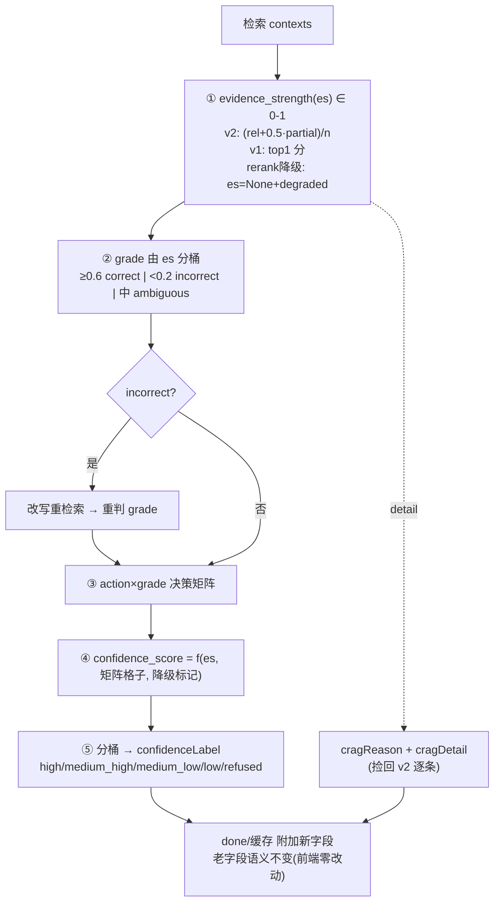

# 置信度/CRAG 标签体系细化方案（confidence refinement）

- **日期**：2026-07-24
- **状态**：Draft（待评审 → 分批实施）
- **背景**：问答全链路优化与数据飞轮落地后，复盘"答案可信度呈现"发现：`confidence` 只有 `high/medium/refused` 3 档，且 CRAG 分级（v1 rerank top1 分数 / v2 LLM 逐条评估）产出的**有价值信号在映射环节被压扁**——v2 逐条 `relevant/partial/irrelevant` detail 被丢弃、`low` 是从不产出的死标签、`ambiguous` 成因各异却一刀切为 `medium`、rerank 挂掉时全量降级 `medium`、`refused` 不带原因、机器置信度与人工 `dislike` 从不对齐。
- **硬约束**：全 opt-in（新开关默认关，关=现状）；**前端零改动**（老字段 `confidence/cragAction/cragGrade` 语义不变，新字段附加下发）；每批独立可测 commit；测试先行；显式 git add；main 分支；复用 `crag`/`crag_v2`/`_crag_correct`/`config_service.rt_*` 既有范式，**零新底座**。

---

## 一、目标（量化）

| 指标 | 现状 | 目标 |
|---|---|---|
| confidence 档位颗粒度 | 3 档（high/medium/refused） | 5 细分档 + 连续 score(0-1) |
| 死标签 `low` 产出率 | 0（docstring 提及但 `confidence_of` 从不返回） | 真正按分桶产出 |
| v2 detail 利用率 | 0（`grade, _ = ...` 丢弃） | 100% 回流进 score/归因/指标/前端 |
| `refused` 归因 | 无（前端静态文案） | 4 类（no_recall/rewrite_exhausted/out_of_domain/evidence_contradict） |
| v1/v2 分级口径 | 漂移（绝对阈值 vs 相对计数） | 统一 `evidence_strength` ∈ [0,1] |
| rerank 降级可区分 | 全压成 `medium` | `evaluatorDegraded` 标记独立计 |
| 机器/人工标签对齐 | 不对齐（high+dislike 无仲裁） | `over_confident` 冲突检测 + 缓存降级联动 |

---

## 二、现状盘点（置信度/CRAG 标签链路）

| 环节 | 代码落点 | 标签 | 现状问题 |
|---|---|---|---|
| 分级 v1 | `rag/crag.py::grade` | correct/ambiguous/incorrect | top1 rerank 分绝对阈值 0.6/0.3 |
| 分级 v2 | `rag/crag_v2.py::grade_with_llm` | relevant/partial/irrelevant→grade | **detail 被调用方丢弃**；默认关 |
| 置信度映射 | `rag/crag.py::confidence_of` | high/medium/refused | 3 档；`low` 死标签；ambiguous 一刀切 |
| 纠错动作 | `qa_service._crag_correct` | normal/rewritten/refused | 线性状态机，无矩阵 |
| 阈值 | `config.py:143-144` | CRAG_HIGH=0.6/CRAG_LOW=0.3 | 硬编码，不可热调 |
| 前端展示 | `Chat.vue::confLabel/confTitle` | high/medium/refused | 静态文案，无归因 |
| 机器人工对齐 | `feedback` × `confidence` | — | 不交叉，无冲突仲裁 |

---

## 三、断点识别（代码位置）

| 断点 | 代码事实 | 后果 |
|---|---|---|
| **A. v2 detail 被丢** ⭐ | `qa_service.py:112` `grade, _ = crag_v2.grade_with_llm(...)` | 最有价值的逐条相关性信号未进 score/归因/指标 |
| **B. confidence 3档+死标签+一刀切** | `confidence_of` 只返 high/medium/refused；docstring 提 low 但从不产出；ambiguous 全 medium | 颗粒度粗，前端无法解释"为什么证据有限" |
| **C. v1/v2 口径漂移** | v1 绝对阈值(`CRAG_HIGH/LOW`) vs v2 相对计数(`≥2 relevant`) | `CRAG_PERDOC_ENABLE` 开关切换，同批 contexts 的 grade/confidence 会变 |
| **D. rerank 降级强制 ambiguous** | `crag.grade` 里 `not rerank_ok → ambiguous` | rerank 挂/未开时所有问题全 medium，无法区分"真证据有限"vs"评估器瞎了" |
| **E. action 扁平 + refused 无归因** | normal/rewritten/refused 三态线性；refused 不带原因 | 纠错闭环效果不可观测；用户/运维无法定位拒答原因 |
| **F. 阈值硬编码** | `CRAG_HIGH/LOW` 在 settings，改要重启 | 无法按 docType/场景动态分级 |
| **G. 机器人工不对齐** | `feedback` 写入不交叉历史 confidence | high 置信度被 dislike 打架，无仲裁不反哺 |

---

## 四、顶层设计：confidence 升级模型



**底层逻辑**：分级信号采集到什么就解释什么——es 统一 v1/v2 口径，矩阵替代线性 action，detail 回流做归因，分桶+score 双轨（score 供看板阈值，label 供展示）。

---

## 五、详细方案（P1-P3，分阶段）

### P1-1 · 捡回 v2 detail（断点 A，最高 ROI）

- **现状**：`qa_service.py:112` `grade, _ = crag_v2.grade_with_llm(nq, contexts, model_type)`，逐条 `relevant/partial/irrelevant` detail 被丢弃。
- **改**：保留 detail `_detail`，组装为 `cragDetail={relevant,partial,irrelevant,n}`，并生成人话 `cragReason`（如 "1 relevant + 0 partial / 5 条"）随 done/缓存下发。
- **文件**：`services/qa_service.py::_crag_correct`（捡 detail + 组装字段）
- **开关**：复用 `CRAG_V3_ENABLE`（总开关，默认关）
- **测试**：`tests/test_confidence_refinement.py`——v2 路径返回的 `cragDetail` 计数正确 + `cragReason` 含计数。

### P1-2 · 连续置信度 + 5 档 + 修死标签 low（断点 B）

- **现状**：`confidence_of(grade, rewritten)` 只返 high/medium/refused，`low` 死标签，ambiguous 一刀切 medium。
- **改**：
  1. 新增 `crag.evidence_strength()`：v2 路径 `(relevant + 0.5·partial)/n_judged`，v1 路径 `top1` 分，rerank 降级返 `None`。
  2. 重构 `confidence_of` → `confidence_score(es, matrix_cell, degraded) -> (score, label)`，5 档分桶：`≥0.7 high | 0.5-0.7 medium_high | 0.35-0.5 medium_low | 0.2-0.35 low | <0.2 refused`。`low` 真正产出。
  3. 老字段 `confidence` 由 label 首段映射（high/medium/refused）保持前端兼容。
- **文件**：`rag/crag.py`（`evidence_strength` + `confidence_of` 重构）+ `qa_service.py`（调用新签名）
- **开关**：`CRAG_V3_ENABLE`（默认关；关=`confidence_of` 走老逻辑零破坏）
- **测试**：`low` 档真产出（ambiguous+降级场景）；5 档边界；关开关=老 3 档。

### P2-1 · v1/v2 口径统一（断点 C）

- **现状**：v1 绝对阈值、v2 相对计数，`CRAG_PERDOC_ENABLE` 切换 grade 漂移。
- **改**：`grade()` 改吃 `evidence_strength` 分桶（复用 P1-2 的 es 阈值），`CRAG_HIGH/LOW` 退化为 es 阈值。v2 路径先 `labels_to_grade` 再算 es，两者口径一致。
- **文件**：`rag/crag.py::grade` + `rag/crag_v2.py`（es 计算）
- **开关**：`CRAG_V3_ENABLE`
- **测试**：同批 contexts，PERDOC 开/关，grade 一致（口径稳定回归）。

### P2-2 · 降级精细化 + action 矩阵 + refused 归因（断点 D + E）

- **现状**：rerank 降级强制 ambiguous；action 线性 3 态；refused 无原因。
- **改**：
  1. `evaluatorDegraded=True` 时 es=None，confidence 封顶 `low`，独立指标计，不混入真 ambiguous。
  2. action 矩阵化：`(初始grade, 改写后grade)` 落格 → `normal/rewritten_recovered/rewritten_partial/rewritten_failed/boosted`；记 `rewriteDelta=改写后es-改写前es`。
  3. `refusedReason`：`no_recall`(contexts空) / `rewrite_exhausted`(改写后仍incorrect) / `out_of_domain`(Self-RAG skip 对齐) / `evidence_contradict`(v2无relevant且NLI contradict，复用 `_verify_claims`)。
- **文件**：`services/qa_service.py::_crag_correct`（矩阵 + refused 归因）+ `rag/crag.py`
- **开关**：`CRAG_V3_ENABLE`
- **测试**：矩阵 9 格全覆盖；refused 4 类各触发一次；`rewriteDelta` 符号正确。

### P2-3 · 阈值热调（断点 F）

- **现状**：`CRAG_HIGH/LOW` 在 settings，改要重启。
- **改**：进 `config_service.rt_crag_high()/rt_crag_low()` 热读（对齐 `rt_temperature/rt_ef` 模式），Redis 覆盖优先；预留按 docType 覆盖 hook。
- **文件**：`services/config_service.py` + `rag/crag.py`（读 rt_*）
- **开关**：无（热读，默认回退 settings）
- **测试**：Redis 覆盖值生效；无覆盖回退默认。

### P3-1 · 机器/人工标签对齐·over_confident 仲裁（断点 G）

- **现状**：`feedback` 写入不交叉历史 confidence，high+dislike 无仲裁。
- **改**：`feedback_service.record_feedback` 收到 dislike 时，查该 query 历史 confidence∈{high} → 打 `over_confident` 标签 → 触发该 query L1/L2 缓存降级失效 + 进 `evidence_gap` 复核 + 喂 `FEEDBACK_FIX_RATE`。
- **文件**：`services/feedback_service.py`（冲突检测 + 联动）+ 复用 `cache_persist`/`evidence_gap_service`
- **开关**：`CONFIDENCE_OVERCONFIDENT_ENABLE`（默认关）
- **测试**：high+dislike → `over_confident` 标记 + 缓存失效 + evidence_gap 新行。

---

## 六、数据结构变更（新 confidence 产物）

```python
# _crag_correct 返回 + done 事件 + 缓存附加（老字段全保留，前端零改动）
{
  # —— 向后兼容（不动）——
  "confidence": "medium", "cragAction": "normal", "cragGrade": "ambiguous",
  # —— 新增：连续 + 归因 ——
  "confidenceScore": 0.42, "confidenceLabel": "medium_low",
  "evidenceStrength": 0.40,
  "cragReason": "1 relevant + 0 partial / 5 条（v2 per-doc）",
  "cragDetail": {"relevant":1,"partial":0,"irrelevant":4,"n":5},
  "refusedReason": "", "evaluatorDegraded": false, "rewriteDelta": null,
}
```

缓存 version bump（对齐 `citation_cache_version()` 模式）：cv 加 `R` 段（confidence 模型代际），避免老缓存缺新字段。

---

## 七、可观测闭环

- 新指标（`core/metrics.py`）：
  - `grid_crag_evidence_strength`（Histogram，es 分布）
  - `grid_crag_confidence_total` label 维度扩到 5 细分档
  - `grid_crag_refused_reason_total`（Counter by refusedReason）
  - `grid_crag_rewrite_delta`（Histogram，纠错增益，正=救回）
  - `grid_overconfident_total`（Counter，P3 冲突检出）
- `init_metric_series` 预注册 0 值（对齐既有"指标未触碰前 /metrics 隐身"的坑）。
- Grafana：confidence 面板从 3 档饼图 → 细分档 + es 分布 + refused 归因 + 改写增益。

---

## 八、验收

- **开关关**：`CRAG_V3_ENABLE=False` 行为=现状（done 字段 diff 0，老 3 档）。
- **单测**：`confidence_of` 5 档边界 + low 真产出、`evidence_strength` v1/v2 两路、矩阵 9 格、refused 4 类、over_confident 仲裁。
- **回归**：`tests/test_crag.py`、`tests/test_crag_v2.py`、golden 问答集全绿。
- **在线**：`gen_traffic.py` 的 OFF query（量子纠缠/红烧肉）稳定落 `refused + refusedReason=out_of_domain/no_recall`；`grid_crag_rewrite_delta` 可观测。
